# Cryptocurrencies
Use unsupervised machine learning techniques to analyze cryptocurrency data.

## Background

Accountability Accounting, a prominent investment bank, is interested in offering its customers a new cryptocurrency investment portfolio.  

The first decentralized cryptocurrency was Bitcoin, which was first released in 2009.  
However, the popularity of Bitcoin has caused a price jump that makes it unaffordable for many new investors.  
As of March 2022, there were more than 9,000 other cryptocurrencies in the marketplace, and many of them are available at more affordable prices than Bitcoin. 

The AA company, however, is lost in the vast universe of cryptocurrencies. So, they have requested a report that includes what cryptocurrencies are on the trading market and how they could group them to create a classification system for this new investment.  

### Purpose
The cryptocurrency data provided by the company for this analysis were retrieved from the CryptoCompare website. The raw dataset was not ideal for a machine learning model, so it must be processed to fit the machine learning models.  
There is no known output for the cryptocurrency classification. Hence an unsupervised machine learning model is optimal for analyzing the data.  
First, we will use the K-means clustering algorithm to group the cryptocurrencies. Then, we will use data visualizations to share the findings with the Accountability Accounting board. 

## Objectives
1. Preprocessing the data for Principal Component Analysis (PCA).
2. Reducing data dimensions using PCA.
3. Clustering cryptocurrencies using K-means.
4. Visualizing cryptocurrencies results. 

## Resources 
- Data Sources: crypto_data.csv, crypto_clustering.ipynb.
- Software & Framework: Python (3.7.13), Jupyter Notebook (6.4.11).
- Libraries & Packages: Pandas (1.3.5), Plotly (5.9.0-py_0), hvPlot (0.8.0).
- Online Tools: [Cryptocurrencies GitHub repository](https://github.com/Magzzie/Cryptocurrencies)

## Methods & Code

1. Preprocessing the data for PCA:
- Using Pandas library and Jupyter Notebook, we processed the dataset in order to perform Principal Component Analysis in the next step:
    - We loaded the data file into a Pandas DataFrame and set the index equal to the original index in the data file. 
    - The CryptoCompare dataset contained 1,252 records of actively traded and untraded cryptocurrencies, arranged in 6 columns.  
    
        ||
        |-|
    
    - We Filtered the original currencies dataset based on active trading status and kept only traded currencies, 1,144.  
    
        ||
        |-|
    
    - Then, we dropped the 'IsTrading' columns and NaNs-containing rows and confirmed working algorithms for all included currencies. We ended up with 685 rows in 5 columns.  
    
        |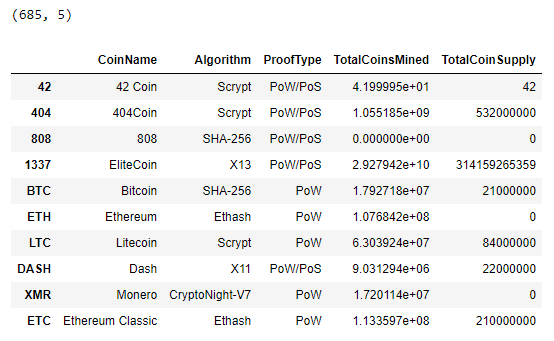|
        |-|
    
    - Additionally, we filtered for only mined currencies, meaning the total coins mined more than zero, and we ended up with 532 rows in 5 columns.  
    
        ||
        |-|
    
    - Furthermore, we separated the Coins' Names into their own DataFrame and dropped the 'CoinName' column from the features DataFrame since it would not be used in the clustering algorithm.   
      
        || 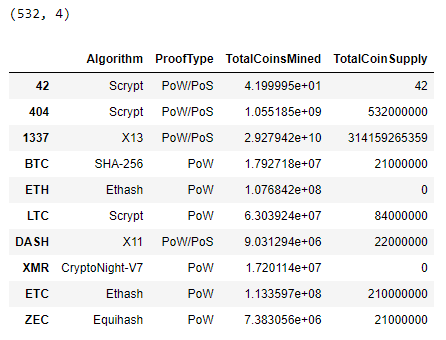 |
        |-|-|
    
    - Next, we transformed text variables into numerical values to be viable for use by the clustering algorithm, using the get_dummies method from the Pandas library.  The transformation focused on 'Algorithm' and 'ProofType' columns, which increased the total number of feature columns from 4 to 98.  
    
        ||
        |-|
    
    - Finally, we scaled the features dataset using the StandarScaler model from the scikit-learn library.   Using standardization, we center the feature columns at mean 0 with a standard deviation of 1 to take the form of a normal distribution, making it easier to learn the weights.  Furthermore, standardization maintains useful information about outliers and makes the machine learning algorithm less sensitive to them. 
    
        |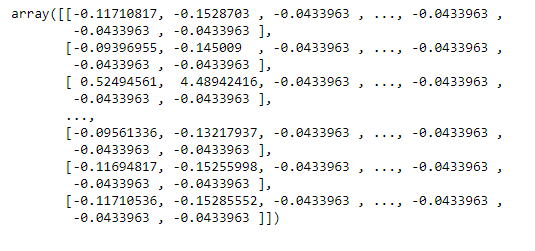|
        |-|
        
2. Reducing data dimensions using PCA: after standardizing the crypto data, we can use PCA to reduce the number of features.
    - The scaled crypto data contained 98 feature columns. That is considered a significant number to input into the classification algorithm. 
    - Hence, we used Principal Component Analysis, a complicated statistical technique, to reduce the number of dimensions (features) which would speed up the machine learning algorithm. 
    - We imported the PCA model from the scikit-learn library, then fit and transformed the scaled data. 
    - After this dimensionality reduction, we got a smaller set of three dimensions called principal components. 
    - These new components were just the three main dimensions of variation that contained most of the information in the original dataset.
    
        |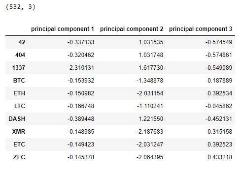|
        |-|

3. Clustering cryptocurrencies using the K-means algorithm:
    - We created an elbow curve using the hvPlot library to find the best value for K from the scaled and standardized crypto DataFrame. 
    - We started by calculating the inertia for a range of K values (clusters number) using the preprocessed data. Then, we created a DataFrame of the K and inertia values and plotted it on a line graph. 
    - To decide on the best K value, we looked for the break where the vertical direction shifted to a strong horizontal direction. 
    
        |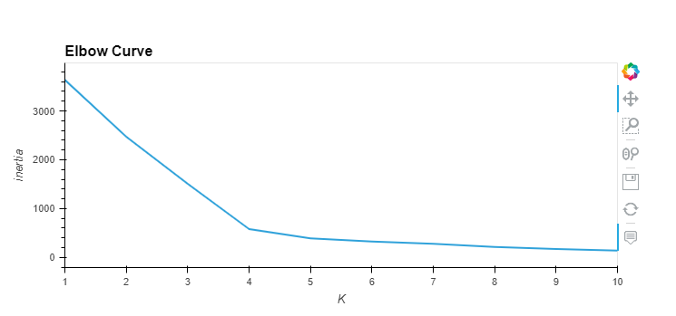|
        |-|
        
    - Using the suggested grouping of four clusters, we built an unsupervised machine learning model based on the K-means algorithm. 
    - We specified a random state of zero in the classification algorithm, which would render different results between runs and users. 
    - Next, we fit, transformed, and made predictions on the scaled and standardized crypto data. 
    
        |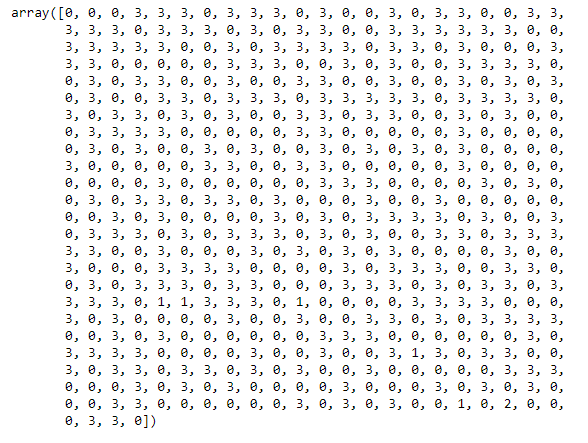|
        |-|
        
    - Furthermore, we created a comprehensive DataFrame of the original four feature columns, their three resulting Principal Components, the corresponding coin name, and the class of each currency.
    
4. Visualizing cryptocurrencies results:
    - We used scatter plots and line graphs from the Plotly Express and hvPlot libraries.
    - First, we created a three-dimensional (3D) scatter plot using the Plotly Express scatter_3d() function that showed the four clusters produced by the K-means model. This interactive graph can display coin information like the coin's name and working algorithm when hovered over. 
    - Then, we created a table of all the presently tradable cryptocurrencies using hvplot.table() function. The table is sortable and selectable to facilitate inspection of the training data. 
    - Next, we used the MinMaxScaler() model to scale the 'TotalCoinSupply' and 'TotalCoinsMined' columns between zero and one. Moreover, we created a DataFrame of the scaled data along with the coins' names and classes. 
        
        |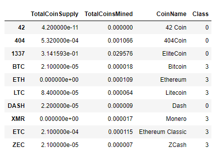|
        |-|
        
    - Eventually, we plotted the MinMax-scaled crypto data of Total Supply and Total Mined on a two-dimensional (2D) scatter plot using the hvPlot library and color-divided the classes. 
    
    

## Results 

- The CryptoCompare dataset about cryptocurrencies initially contained 1,252 records. 
- After preprocessing the dataset to apply Principal Component Analysis, we reduced it to 532 records of actively trading, mined cryptocurrency coins with confirmed algorithms. 
- Each row in the features dataset contains information about the trading coin name, its working algorithm, proof type, total number mined, and the total coin supply for each currency. 
- The filtered data were then transformed entirely to numerical values, standardized with StandadScaler, then features were reduced from 98 to only three principal components. 
- Based on the elbow curve plot, we classified the cryptocurrency data into four distinct clusters. 

    |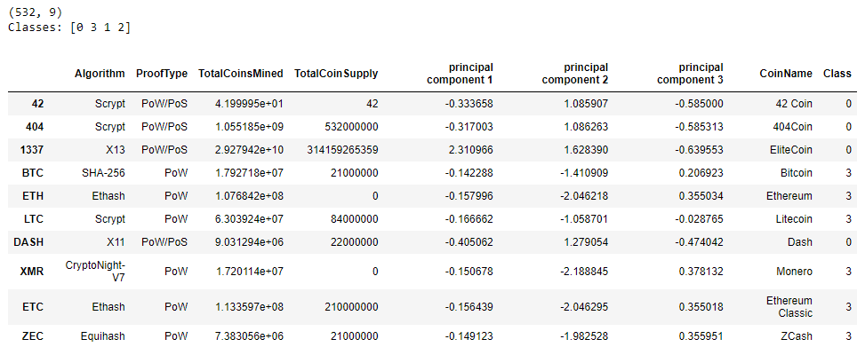|
    |-|
    
- The three-dimensional scatter plot represents the rendered classification of the currently tradable cryptocurrencies according to the CryptoCompare dataset. 
    - The plot showed that the K-means classification algorithm had made a decent effort in grouping the data points into four clusters per our specification. 
    
        |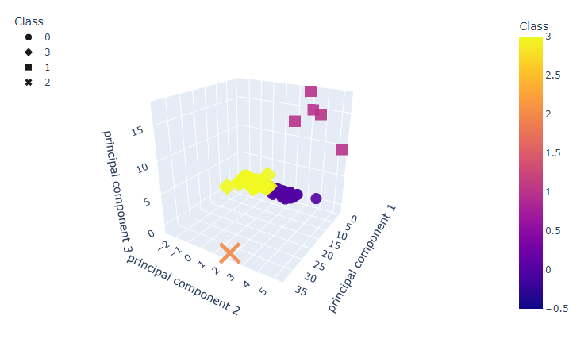|
        |-|
        
    - Interestingly, BitTorrent was an obvious outlier among the tradable cryptocurrencies. The outlier was installed in a separate cluster by the K-means classification algorithm. 
    
        |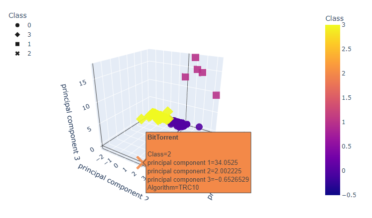|
        |-|
    
    - Since we used a random state of zero for the unsupervised classification algorithm in this analysis, we would expect different results every time the model is run. We tested the model more than once and collected a folder of first-run and second-run results in the following link: [K-means Classification Outputs.](https://github.com/Magzzie/Cryptocurrencies/tree/workingBranch/Images)

- The Tradable Table displays all 532 records of currently trading cryptocurrencies according to the CryptoCompare dataset. 
    - The table allows for easy inspection of each currency record and the applied clustering per our K-means model.
    
        |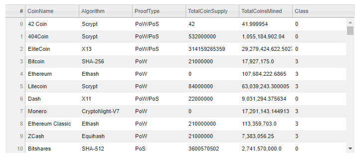|
        |-|
        
    - The Tradable Table is accessible from the python code file: [crypto_clustering.ipynb](https://github.com/Magzzie/Cryptocurrencies/blob/workingBranch/crypto_clustering.ipynb)
    
- Lastly, the 2D scatter plot of the total number of mined coins against their supply for each traded cryptocurrency shows the four clusters and the outlier BitTorrent. 
    
    |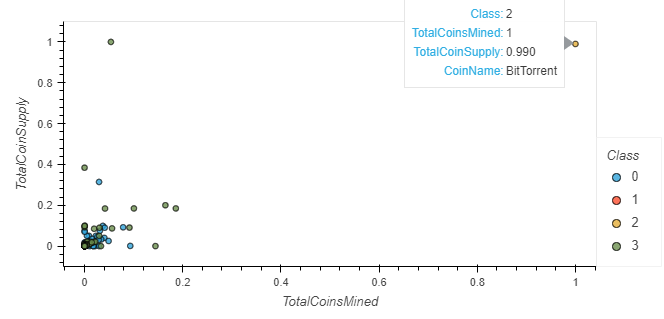|
    |-|

## Conclusions

- Cryptocurrency mining is the process by which new bitcoins are entered into circulation. It is also the way the network confirms new transactions and is a critical component of the blockchain ledger's maintenance and development. Cryptocurrency mining is painstaking, costly, and only sporadically rewarding. Nonetheless, mining has a magnetic appeal for many investors who are interested in cryptocurrency because of the fact that miners receive rewards for their work with crypto tokens. [@investopedia](https://www.investopedia.com/tech/how-does-bitcoin-mining-work/#:~:text=Bitcoin%20mining%20is,with%20crypto%20tokens.)
- When a cryptocurrency has been mined, miner revenue will depend entirely on transaction fees. The price and purchasing power of the mined currency will adjust to the lack of new supply. Hence, its scarcity will make it more attractive to investors and users.[@river](https://river.com/learn/what-will-happen-after-all-bitcoin-mined/)
- The maximum supply of a cryptocurrency refers to the maximum number of coins or tokens that will be ever created. This means that once the maximum supply is reached, there won't be any new coins mined, minted or produced in any other way.[@binance_academy](https://academy.binance.com/en/glossary/maximum-supply#:~:text=The%20maximum%20supply%20of%20a%20cryptocurrency%20refers%20to%20the%20maximum%20number%20of%20coins%20or%20tokens%20that%20will%20be%20ever%20created.%20This%20means%20that%20once%20the%20maximum%20supply%20is%20reached%2C%20there%20won%E2%80%99t%20be%20any%20new%20coins%20mined%2C%20minted%20or%20produced%20in%20any%20other%20way.)
- BitTorrent is a trading cryptocurrency at max supply and near maximum mining, making it a potentially beneficial inverstment for Accountability Accounting Bank's customers. 

---
