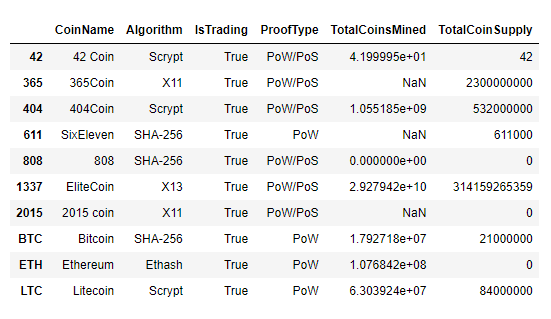
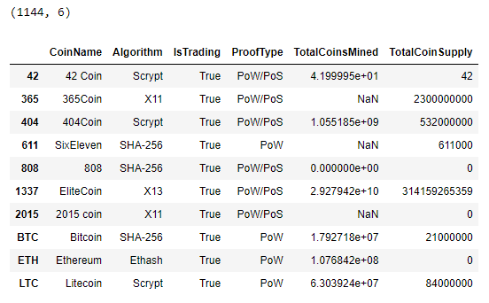
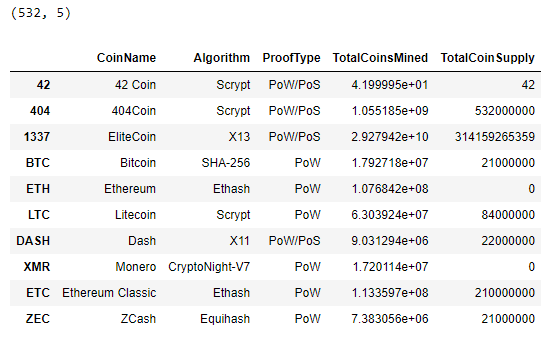
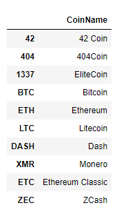
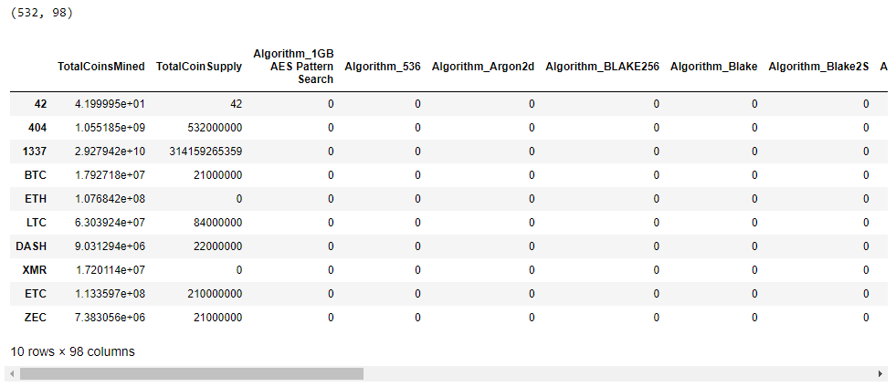

# Cryptocurrencies
Use unsupervised machine learning techniques to analyze cryptocurrency data.

## Background

Accountability Accounting, a prominent investment bank, is interested in offering its customers a new cryptocurrency investment portfolio.  

The first decentralized cryptocurrency was Bitcoin, which was first released in 2009.  
However, the popularity of Bitcoin has caused a price jump that makes it unaffordable for many new investors.  
As of March 2022, there were more than 9,000 other cryptocurrencies in the marketplace, and many of them are available at more affordable prices than Bitcoin. 

The AA company, however, is lost in the vast universe of cryptocurrencies. So, they have requested a report that includes what cryptocurrencies are on the trading market and how they could group them to create a classification system for this new investment.  

### Purpose
The cryptocurrency data provided by the company for this analysis were retrieved from the CryptoCompare website. The raw dataset was not ideal for a machine learning model, so it must be processed to fit the machine learning models.  
There is no known output for the cryptocurrency classification. Hence an unsupervised machine learning model is optimal for analyzing the data.  
First, we will use the K-means clustering algorithm to group the cryptocurrencies. Then, we will use data visualizations to share the findings with the Accountability Accounting board. 

## Objectives
1. Preprocessing the data for Principal Component Analysis (PCA).
2. Reducing data dimensions using PCA.
3. Clustering cryptocurrencies using K-means.
4. Visualizing cryptocurrencies results. 

## Resources: 
- Data Sources: crypto_data.csv, crypto_clustering.ipynb.
- Software & Framework: Python (3.7.13), Jupyter Notebook (6.4.11).
- Libraries & Packages: Pandas (1.3.5), Plotly (5.9.0-py_0), hvPlot (0.8.0).
- Online Tools: [Cryptocurrencies GitHub repository](https://github.com/Magzzie/Cryptocurrencies)

## Methods & Code

1. Preprocessing the data for PCA:
- Using Pandas library and Jupyter Notebook, we processed the dataset in order to perform Principal Component Analysis in the next step:
    - We loaded the data file into a Pandas DataFrame and set the index equal to the original index in the data file. 
    - The CryptoCompare dataset contained 1,252 records actively traded and untraded cryptocurrencies, arranged in 6 columns.  
    
        ||
        |-|
    
    - We Filtered the original currencies dataset based on active trading status and kept only traded currencies, 1,144.  
    
        ||
        |-|
    
    - Then, we dropped the 'IsTrading' columns and NaNs-containing rows and confirmed working algorithms for all included currencies. We ended up with 685 rows in 5 columns.  
    
        ||
        |-|
    
    - Additionally, we filtered for only mined currencies, meaning the total coins mined more than zero, and we ended up with 532 rows in 5 columns.  
    
        ||
        |-|
    
    - Furthermore, we separated the Coins' Names into their own DataFrame and dropped the 'CoinName' column from the features DataFrame since it would not be used in the clustering algorithm.   
      
        ||  |
        |-|-|
    
    - Next, we transformed text variables into numerical values to be viable for use by the clustering algorithm, using the get_dummies method from the Pandas library.  The transformation focused on 'Algorithm' and 'ProofType' columns, which increased the total number of feature columns from 4 to 98.  
    
        ||
        |-|
    
    - Finally, we scaled the features dataset using the StandarScaler model from the scikit-learn library.   Using standardization, we center the feature columns at mean 0 with a standard deviation of 1 so that the feature columns take the form of a normal distribution, which makes it easier to learn the weights.  Furthermore, standardization maintains useful information about outliers and makes the machine learning algorithm less sensitive to them. 
    
        ||
        |-|
        
2. Now that the data has been standardized, we can use PCA to reduce the number of features.
    - The scaled crypto data contained 98 feature columns. That is considered a significant number to input into the classification algorithm. 
    - Hence, we used Principal Component Analysis, a complicated statistical technique, to reduce the number of dimensions (features) which would speed up the machine learning algorithm. 
    - We imported the PCA model from the scikit-learn library, then fit and transformed the scaled data. 
    - After this dimensionality reduction, we get a smaller set of three dimensions called principal components. 
    - These new components are just the three main dimensions of variation that contain most of the information in the original dataset.

## Results 

- The CryptoCompare dataset about cryptocurrencies initially contained 1,252 records. 
- After preprocessing the dataset to apply Principal Component Analysis, we reduced it to 532 records of actively trading, mined cryptocurrency coins with confirmed algorithms. 
- Each row in the features dataset contains information about the coin name, its working algorithm, whether it is trading, proof type, total number mined, and the total coin supply for each currency. 
- The filtered data were then transformed entirely to numerical values, standardized with StandadScaler, then features were reduced from 98 to only three principal components. 

## Recommendations & Limitations

---
